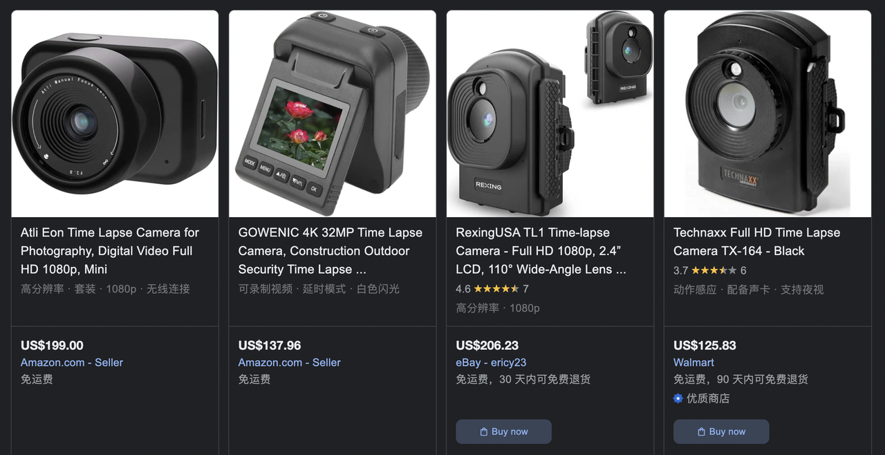
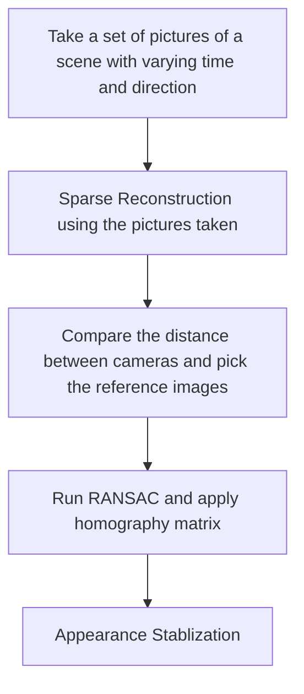
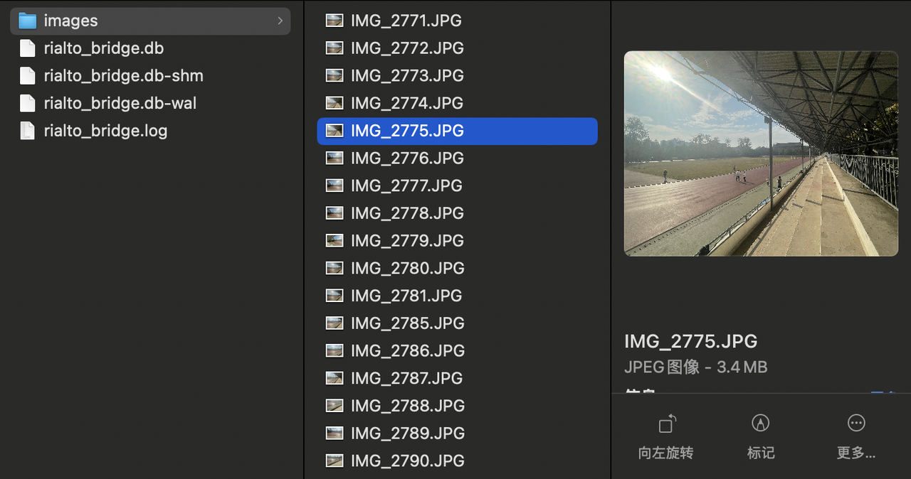
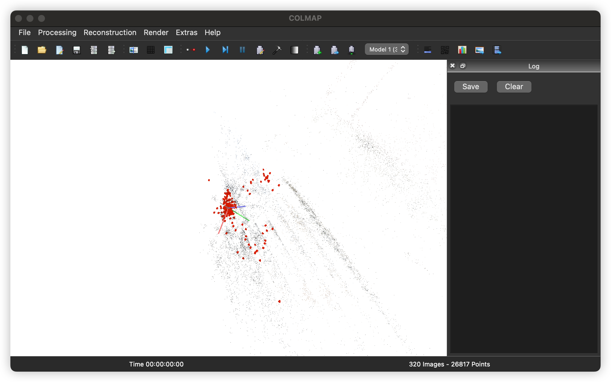
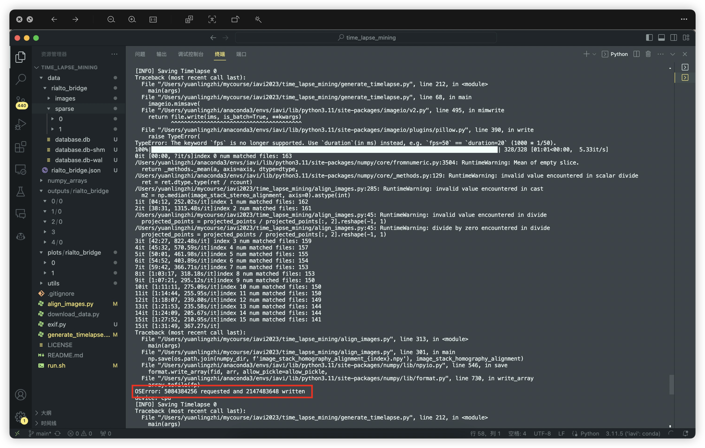
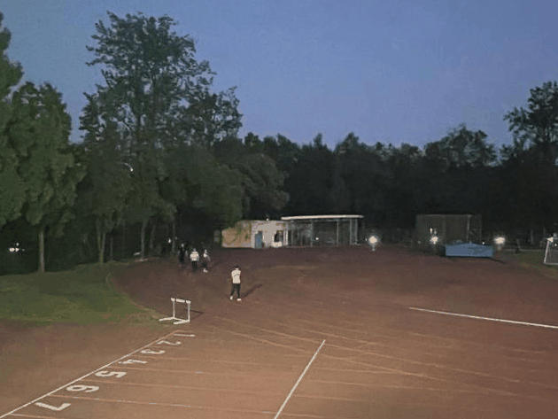
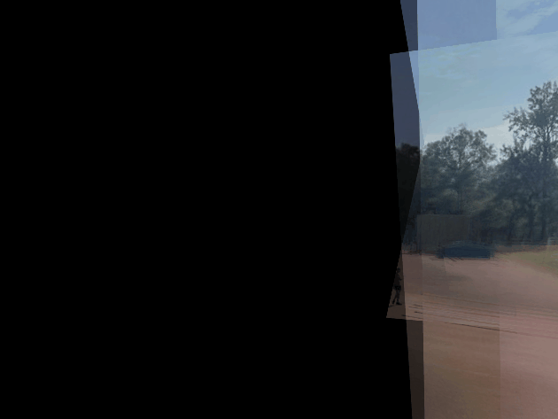
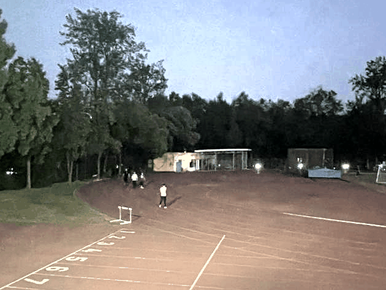

## IAVI Final Project - Timelapse Video Generation from a Set of Images with Multiple Directions of Viewing

Group 4 - 袁凌志、林俊光、裴劭轩

<div class="abs-br m-6 flex gap-2">
  <button @click="$slidev.nav.openInEditor()" title="Open in Editor" class="text-xl slidev-icon-btn opacity-50 !border-none !hover:text-white">
    <carbon:edit />
  </button>
  <a href="https://github.com/slidevjs/slidev" target="_blank" alt="GitHub"
    class="text-xl slidev-icon-btn opacity-50 !border-none !hover:text-white">
    <carbon-logo-github />
  </a>
</div>

---
layout: default
level: 2
---

# Table of contents

<Toc maxDepth="1"></Toc>


---
transition: slide-up
level: 1
---

# Background and Motivation - Time-lapse Photography
The frequency at which film frames are captured (the frame rate) is much lower than the frequency used to view the sequence. 

- **When playing at normal speed, time appears to be moving faster**


<br>


<style>

</style>


---
transition: slide-up
level: 2
---

# Time and Cost

However, it is generally difficult to take a time-lapse video with high quality.

Traditional method?

- Use professional camera device
- Camera placed on a fixed tripod
- Take pictures at a constant time interval


<div style="display: flex;">
  
  
</div>


---
transition: slide-left
level: 2
---

# Our Approach

We want to implement a system that can help us generate a time lapse video easily and unconstraintly. 


<style>
.footnotes-sep {
  @apply mt-20 opacity-10;
}
.footnotes {
  @apply text-sm opacity-75;
}
.footnote-backref {
  display: none;
}
</style>

---
transition: slide-up
level: 1
---

# Pipeline 
<!-- add mermaid -->
<div style="text-align:center">

</div>

---
transition: slide-up
level: 2
---
# Take a set of pictures of a scene with varying time and direction
We use a mobile phone to take a set of pictures in our campus from day to night.




---
transition: slide-up
level: 2
---

# Sparse Reconstruction using the pictures taken
<br>
We then use the tool colmap to do sparse reconstruction.




---
transition: slide-up
level: 2
---

# Compare the distance between cameras and pick the reference images

Then we can use the information of the result to find the reference images. We simply read out the camera's translation matrix of each image and compute the distance. Then we choose the 20 most popular images as reference images.
```python
img1_points_2d = img_filename_to_2d_points[img1_filename]
for img2_filename in img_filename_to_metadata:
    if img1_filename == img2_filename:
        continue

    img2_points_2d = img_filename_to_2d_points[img2_filename]

    # find matching points between img1 and img2
    matched_observed_point_ids = get_matching_point_ids(img1_points_2d, img2_points_2d)
    
    _, qw2, qx2, qy2, qz2, tx2, ty2, tz2, _ = img_filename_to_metadata[img2_filename]
    
    dist_between_cameras = (((tx1 - tx2) ** 2) + ((ty1 - ty2) ** 2) + ((tz1 - tz2) ** 2)) ** 0.5
    
    if dist_between_cameras > 1:
        continue
    else:
        img_filename_to_close_cameras[img1_filename].append(img2_filename)
```


---
transition: slide-up
level: 2
---

# Run RANSAC and apply homography matrix

There exists a homography between each pair of images. Therefore, we can apply a homography matrix to wrap an image into another image:
$$
\left[\begin{array}{c}
x^{\prime} \\
y^{\prime} \\
1
\end{array}\right]=\left[\begin{array}{ccc}
h_{11} & h_{12} & h_{13} \\
h_{21} & h_{22} & h_{23} \\
h_{31} & h_{32} & h_{33}
\end{array}\right]\left[\begin{array}{c}
x \\
y \\
1
\end{array}\right]
$$
where $h_{ij}$ is the homography matrix.


---
transition: slide-up
level: 2
---

# Run RANSAC and apply homography matrix
A pair of matching points can compose 2 equations. Because a homography matrix has 8 degrees of freedom, we can compute H by 4 pairs of matching points.

<br>
$$
\left[\begin{array}{ccccccccc}
x_i & y_i & 1 & 0 & 0 & 0 & -x_i^{\prime} x_i & -x_i^{\prime} y_i & -x_i^{\prime} \\
0 & 0 & 0 & x_i & y_i & 1 & -y_i^{\prime} x_i & -y_i^{\prime} y_i & -y_i^{\prime}
\end{array}\right]\left[\begin{array}{l}
h_{11} \\
h_{12} \\
h_{13} \\
h_{21} \\
h_{22} \\
h_{23} \\
h_{31} \\
h_{32} \\
h_{33}
\end{array}\right]=0
$$


---
transition: slide-up
level: 2
---

# Appearance Stablization 

<br>
Finally, we apply the loss function to do time regularization. The loss function is defined as:

$$\min _{y_1, \ldots, y_n} \sum_{i \mid x_i \neq \emptyset} \delta\left(\left\|y_i-x_i\right\|\right)+\lambda \sum_i \delta\left(\left\|y_{i+1}-y_i\right\|\right)$$
  where $\delta$ is the Huber loss function, and $\lambda$ is a parameter that controls the trade-off between the two terms.


---

# Problem #1
<br>
After doing the image alignment, we found out that result is too large to be saved, therefore, we do thumbnailing to reduce the size of the image, which trades off the quality of the image for faster computation.

 -->
 
--- 
transition: slide-up
level: 1
---

# Result #1 - Image homography stack
<br>



---
transition: slide-up
level: 2
---

# Result #1 - Median filter
<br>



---
transition: slide-up
level: 2
---

# Result #1 - Mean filter
<br>


---
transition: slide-up
level: 2
---

# Result #1 - Histogram matching
<br>


---
transition: slide-up
level: 2
---

# Result #1 - Huber loss


---

# Problem #2 
<br>
You can find that the view direction of the reference camera is not aligned to the track-and-field ground. What's more, we just use one device to take images, which can't test the feasibility of generating video from different kinds of cameras.

​So we use a basler camera to take another set of images (320) as a supplement. Here is our result after supplement.

<br>


---

# Result #2 

